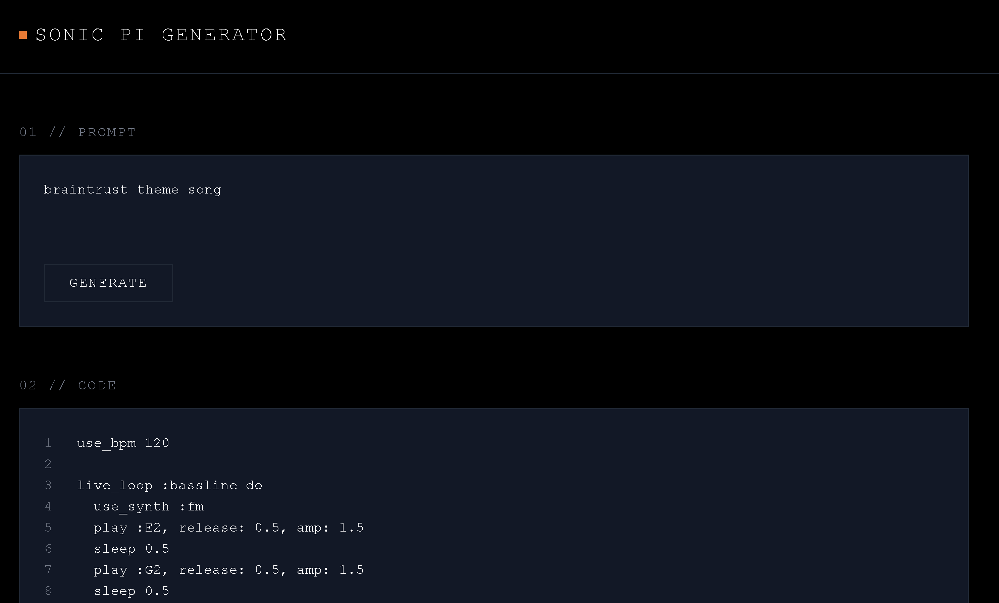

# Prompt -> Music
This AI assistant will take a user prompt and generate Sonic Pi (ruby) code that will then get sent to your local Sonic Pi app via OSC messages. This will allow you to listen to the music it generates :)



## Pre-Requisites
- Have the Sonic Pi application installed locally & running
- Create a Braintrust org & API key

## Install Dependencies
1. Run pnpm install
    ```
    pnpm install
    ```
## Set Up the Demo

### 1. Sonic Pi Token & Port

1. Download Sonic Pi and start running it. (Each time you close out and open it these values will change)
2. Make the helper script (`extract_spider_log_info.sh`) executable:
   ```bash
   chmod +x extract_sonicpi_info.sh
   ```
3. Run to display the port and token:
    ```
    ./extract_sonicpi_info.sh
    ```
4. Add to .env file (rename .env.example)
    ```
    SONIC_PI_SERVER_PORT= 
    SONIC_PI_TOKEN= 
    ```

### 2. Braintrust API Key
1. In the top right of the Braintrust UI you can find your user settings. Make sure you are in the org that you want to publish to.
2. In the User Settings > API Keys you will find a button to create a new API Key, name it "music-code-generator"
3. Finally add the API key to your .env file
    ```
    BRAINTRUST_API_KEY=
    ```

### 3. Push Dataset, Prompts, and Scorers stored in lib folder

Run braintrust push with options for different package managers
  - using pnpm:
    ```
    pnpm dlx braintrust push {file}
    ```
  - using npm:
    ```
    npx braintrust push {file}
    ```

## Run the Demo
1. run the demo using pnpm dev
    ```
    pnpm dev
    ```

### Demo Script

[00:01] Hi, everyone—my name is Carlos.

[00:04] Over the next few minutes, I'll show you how BrainTrust can help you build better AI products faster.

[00:09] BrainTrust is a unified platform for iterating, evaluating, and monitoring every model interaction. Getting started is as easy as hooking up your preferred AI provider.

[00:17] Think of BrainTrust as a DevOps platform designed specifically for AI workflows, combining the continuous integration aspects of GitHub and the observability of Datadog.

[00:24] The heart of this workflow is something called an eval—a test that runs in seconds, fast enough to integrate directly into your CI pipeline, ensuring your AI products are always performing reliably.

[00:32] Evals objectively measure whether your prompts or models meet expectations, significantly reducing development time and boosting confidence in deployment.

[00:38] Let’s jump right into the BrainTrust playground to see how this works.

[00:42] An eval has three components: a task, a dataset, and scores—all easily managed from this interface on the left.

[00:49] I'll walk through an example of how these components improved something I've been building.

[00:55] First, the task: This is simply the code or prompt you want to evaluate. It can range from a simple prompt to an entire agent workflow.

[01:04] For instance, I've been working on an AI assistant that takes a prompt, generates code, and then uses that code to produce music.

[01:11] Initially, I struggled to craft an effective system prompt. The outputs were inconsistent, the music sounded jumbled, and the syntax was often invalid.

[01:21] BrainTrust greatly simplified this iterative process.

[01:24] Here in the playground, I can quickly put two different prompts side-by-side, compare performance, and rapidly improve product quality.

[01:30] I define custom scores to clearly see how each prompt influences the output quality, enabling faster, data-driven decisions.

[01:36] Here’s what that looks like in practice. Notice how the prompt on the right is longer and more detailed.

[01:42] Additionally, I can quickly experiment with different underlying LLM providers, maximizing the efficiency and cost-effectiveness of my AI solutions.

[01:50] With my task defined, I now need a dataset, which is essentially a set of real-world examples—my test cases. For this, I simply uploaded a CSV file, accelerating the evaluation setup.

[01:59] Each test case includes an input, and optionally, an expected output and relevant tags.

[02:04] The third component is scoring.

[02:07] AutoEvals provide powerful built-in evaluation options. For example, "Factuality" is an LLM judge designed to detect hallucinations, helping you build reliable, high-quality AI applications.

[02:17] Other valuable AutoEvals include summarization and translation tasks.

[02:21] For specialized criteria, you can easily create custom scores to precisely align evaluations with your business goals.

[02:28] In my music generation project, I needed scores for musicality and syntax correctness, so I built a "musical judge"—an LLM-based evaluator that mimics a music producer.

[02:38] Here, I can also customize the underlying evaluation model if needed.

[02:42] Additionally, I created a simple TypeScript score that checks if the generated code is syntactically correct, returning a binary pass or fail.

[02:51] Now, with all three components—the task, dataset, and scoring—set up, let’s run an evaluation.

[02:57] The results appear quickly, thanks to parallel processing, allowing rapid iteration and significantly shortening the development cycle.

[03:03] At a glance, I can compare Prompt 1 and Prompt 2, and even toggle the diff view to precisely measure improvements.

[03:10] This makes choosing the best-performing prompt straightforward and efficient.

[03:15] Once satisfied, I can save this snapshot of the playground into the Experiments view.

[03:20] This crucial step lets you establish baselines to measure future progress against, creating a clear historical record of improvements and ensuring continuous product enhancement.

[03:29] Moving from development into production, BrainTrust also captures real user interactions and feedback.

[03:35] I'll show you how easily this integrates into your application.

[03:40] Here, I’ll enter a prompt: "Beethoven in the style of Harry Potter."

[03:46] The AI generates music based on this input. If you were here, you'd hear it playing now.

[03:51] Let’s say the output isn’t ideal—I can provide direct human feedback, such as giving it a thumbs down.

[03:57] Back in BrainTrust, this feedback immediately appears, clearly showing the helpfulness rating of each output.

[04:04] BrainTrust also supports online evaluations, automatically assessing user-generated data points, helping you quickly pinpoint edge cases and continuously refine your product based on real-world usage.

[04:13] You can evaluate all interactions or just a sample percentage, providing an efficient way to maintain quality at scale.

[04:19] These cases can be turned into new datasets for targeted iteration and improvements, enhancing your AI product's robustness and user satisfaction.

[04:25] This is the power of BrainTrust: it enables rapid iteration, precise evaluation, and continuous monitoring—from development through to production—capturing real-time user feedback to consistently refine your AI products and maximize their business value.


